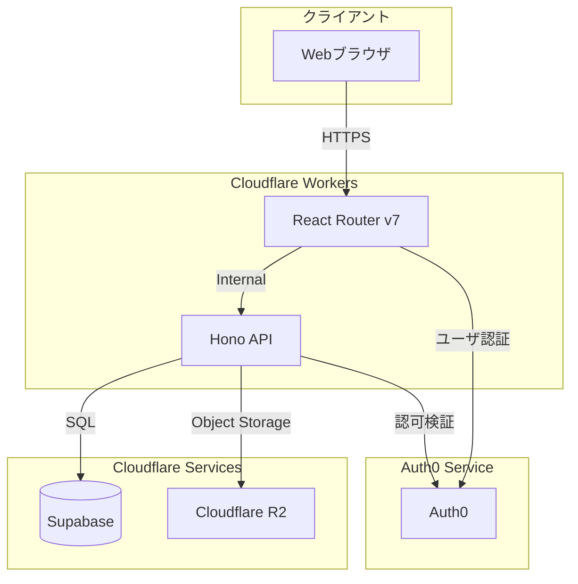

# システム構成設計書

## 1. アーキテクチャ概要

### 1.1 全体構成

### 1.2 技術スタック
- **フロントエンド**
  - Framework: React Router v7
  - 実行環境: Cloudflare Workers
  - 主な機能：
    - SPAベースのユーザーインターフェース
    - クライアントサイドのステート管理
    - サーバーサイドレンダリング

- **バックエンド**
  - Framework: Hono
  - 実行環境: Cloudflare Workers
  - 主な機能：
    - RESTful API提供
    - 認証・認可処理
    - データ永続化処理

- **データストア**
  - データベース: Supabase (PostgreSQL互換)
    - ユーザー情報
    - デッキ・カード情報
    - 学習履歴
  - オブジェクトストレージ: Cloudflare R2
    - カード画像データ

### 1.3 特徴
- エッジでの実行による低レイテンシー
- スケーラブルなサーバーレスアーキテクチャ
- Cloudflareの統合されたサービス群による運用の簡素化

### 1.4 制約事項
- Cloudflare Workersの実行時間制限（CPU時間上限）
- R2のオブジェクトサイズ制限 

### 1.5 開発環境構成
- **Remix Worker**
  - `wrangler dev` によるローカル開発
  - Hot Reloadingによる開発効率の向上

- **API Worker (Hono)**
  - 別プロジェクトとして管理
  - `wrangler dev` による独立した開発環境

- **認証**
  - Auth0による認証基盤
  - 開発環境用のAuth0テナント利用

- **データストア**
  - Supabase: 本番環境用のDBと自動テスト用のDBはクラウド上のSupabaseを使用
  - Supabase: ローカル開発環境では端末上のDockerランタイムを使ってSupabaseコンテナを動かす
  - R2: 開発用バケットを使用

### 1.6 デプロイメントフロー
- **環境分離**
  - 開発環境（ローカル）
    - Supabase（開発Database and 自動テストDatabase）
    - 開発用R2バケット
    - 開発用Auth0テナント
  - 本番環境
    - 本番用Workersインスタンス
    - Supabase（プロダクションDatabase）
    - 本番用R2バケット
    - 本番用Auth0テナント

- **CI/CD パイプライン（GitHub Actions）**
  - プルリクエスト時
    - コードの静的解析
    - TypeScriptの型チェック
    - ユニットテスト実行
    - ビルド確認
  - mainブランチマージ時
    - 本番環境へ自動デプロイ
    - デプロイ後の動作確認

- **デプロイメントプロセス**
  1. 開発者がフィーチャーブランチで開発
  2. プルリクエスト作成
  3. GitHub Actionsによる自動チェック
  4. コードレビュー
  5. mainブランチへのマージ
  6. 本番環境への自動デプロイ 