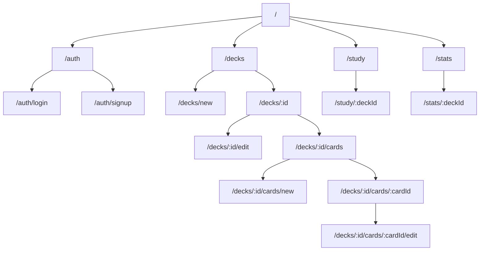

# フロントエンド設計書

## 1. ルーティング構造

## 2. 画面構成と機能

### 2.1 認証関連（/auth/*)
- **ログイン画面** (`/auth/login`)
  - メールアドレスとパスワードによるログイン
  - Auth0との連携

- **サインアップ画面** (`/auth/signup`)
  - 新規ユーザー登録フォーム
  - 基本情報の入力

### 2.2 デッキ管理（/decks/*)
- **デッキ一覧** (`/decks`)
  - 作成済みデッキの一覧表示
  - デッキの検索・フィルタリング
  - 新規デッキ作成ボタン
  - 各デッキの学習進捗サマリー

- **デッキ作成** (`/decks/new`)
  - デッキ名、説明の入力フォーム

- **デッキ詳細** (`/decks/:id`)
  - デッキの基本情報表示
  - カード一覧へのリンク
  - 学習開始ボタン
  - 統計情報サマリー

- **デッキ編集** (`/decks/:id/edit`)
  - デッキ情報の編集フォーム
  - デッキの削除機能

### 2.3 カード管理（/decks/:id/cards/*)
- **カード一覧** (`/decks/:id/cards`)
  - デッキ内のカード一覧
  - タグによるフィルタリング
  - 新規カード作成ボタン
  - 一括編集機能

- **カード作成** (`/decks/:id/cards/new`)
  - 表面・裏面のコンテンツ入力
  - 画像アップロード
  - タグ設定

- **カード編集** (`/decks/:id/cards/:cardId/edit`)
  - カード内容の編集
  - 画像の追加・削除
  - タグの編集
  - カードの削除

### 2.4 学習機能（/study/*)
- **学習セッション** (`/study/:deckId`)
  - カードの表示（表面）
  - カードめくり機能
  - 正誤入力（SM-2スコア）
  - 学習進捗表示
  - セッション終了機能

### 2.5 統計・分析（/stats/*)
- **全体統計** (`/stats`)
  - 全デッキの学習進捗
  - 学習時間の推移
  - 正答率の推移

- **デッキ統計** (`/stats/:deckId`)
  - デッキ別の詳細統計
  - カードごとの正答率
  - 復習予定カード数 