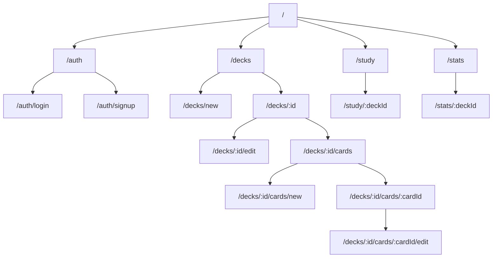

# フロントエンド設計書

## 1. ルーティング構造



## 2. 画面構成と機能

### 2.1 認証関連（/auth/*)
- **ログイン画面** (`/auth/login`)
  - メールアドレスとパスワードによるログイン
  - Auth0との連携

- **サインアップ画面** (`/auth/signup`)
  - 新規ユーザー登録フォーム
  - 基本情報の入力

### 2.2 デッキ管理（/decks/*)
- **デッキ一覧** (`/decks`)
  - 作成済みデッキの一覧表示
  - デッキの検索・フィルタリング
  - 新規デッキ作成ボタン
  - 各デッキの学習進捗サマリー

- **デッキ作成** (`/decks/new`)
  - デッキ名、説明の入力フォーム

- **デッキ詳細** (`/decks/:id`)
  - デッキの基本情報表示
  - カード一覧へのリンク
  - 学習開始ボタン
  - 統計情報サマリー

- **デッキ編集** (`/decks/:id/edit`)
  - デッキ情報の編集フォーム
  - デッキの削除機能

### 2.3 カード管理（/decks/:id/cards/*)
- **カード一覧** (`/decks/:id/cards`)
  - デッキ内のカード一覧
  - タグによるフィルタリング
  - 新規カード作成ボタン
  - 一括編集機能

- **カード作成** (`/decks/:id/cards/new`)
  - 表面・裏面のコンテンツ入力
  - 画像アップロード
  - タグ設定

- **カード編集** (`/decks/:id/cards/:cardId/edit`)
  - カード内容の編集
  - 画像の追加・削除
  - タグの編集
  - カードの削除

### 2.4 学習機能（/study/*)
- **学習セッション** (`/study/:deckId`)
  - カードの表示（表面）
  - カードめくり機能
  - 正誤入力（SM-2スコア）
  - 学習進捗表示
  - セッション終了機能

### 2.5 統計・分析（/stats/*)
- **全体統計** (`/stats`)
  - 全デッキの学習進捗
  - 学習時間の推移
  - 正答率の推移

- **デッキ統計** (`/stats/:deckId`)
  - デッキ別の詳細統計
  - カードごとの正答率
  - 復習予定カード数 

## 3. 認証モジュール設計

認証モジュールはEffectを活用した型安全な実装を採用し、コンポーネント間で一貫した認証処理を提供する。

### 3.1 基本設計方針

- **宣言的アプローチ**: Effect.TSを活用し、手続き型コードと関数型プログラミングのバランスを取った設計
- **型安全性の重視**: 判別可能なユニオン型を使用して認証状態を表現

```typescript
/**
 * 認証状態を表す型
 * ユーザーの認証状態と、認証済みの場合はユーザー情報を提供する
 */
export type AuthStatus =
  | { authenticated: true; user: User } // 認証済み
  | { authenticated: false } // 未認証
```

この型により、認証状態のチェックと同時にユーザー情報へのアクセスが型安全に行える。

### 3.2 主要なデータ構造

中心となるのは`AuthStatus`型で、認証状態を判別可能なユニオン型として表現する：

```typescript
/**
 * 認証状態を表す型
 * ユーザーの認証状態と、認証済みの場合はユーザー情報を提供する
 */
export type AuthStatus =
  | { authenticated: true; user: User } // 認証済み
  | { authenticated: false } // 未認証
```

この型により、認証状態のチェックと同時にユーザー情報へのアクセスが型安全に行える。

### 3.3 主要なAPI

#### 3.3.1 認証状態の取得 - `getAuthStatus`

```typescript
/**
 * ユーザーの認証状態とユーザー情報を取得する
 * @returns 認証済みの場合は{authenticated: true, user: ユーザー情報}、未認証の場合は{authenticated: false}
 */
getAuthStatus: Effect.Effect<
  AuthStatus,
  SessionError | ParseError,
  SessionService | RequestContext
>
```

セッションからユーザー情報を取得し、Schema検証を行った上で認証状態を返す。

#### 3.3.2 認証必須ルートの保護 - `requireAuth`

```typescript
/**
 * 認証が必要なルートに対して認証チェックを行う
 * @param failureRedirect - 未認証時にリダイレクトするURL
 * @returns 認証済みの場合はユーザー情報を返し、未認証の場合はリダイレクトレスポンスを返すEffect
 */
requireAuth: (failureRedirect: string) => 
  Effect.Effect<User, Response, SessionService | RequestContext>
```

認証されていない場合は指定されたURLにリダイレクトし、認証されている場合はユーザー情報を返す。

### 3.4 使用例

#### 3.4.1 ルートローダーでの認証状態取得

```typescript
export const loader = effectLoader(
  Effect.gen(function* () {
    // 認証サービスからAuthStatusを取得
    const { getAuthStatus } = yield* OAuth2Service
    const authStatus = yield* getAuthStatus

    return yield* Effect.succeed(data({ authStatus }))
  }),
)
```

#### 3.4.2 認証必須ルートの保護

```typescript
// 認証が必要なルートのローダー
export const loader = effectLoader(
  pipe(
    // 未認証の場合は/loginにリダイレクト
    requireAuth('/login'),
    // 認証済みの場合はユーザー情報を使って処理を継続
    Effect.flatMap(user => fetchUserData(user.id))
  )
)
```

### 3.5 利点

- **型安全性**: コンパイル時の型チェックにより、多くのバグを事前に防止
- **エラーハンドリングの一貫性**: エラーが明示的に型として表現されるため見落としを防止
- **コードの意図が明確**: 関数の型シグネチャだけで何が起こるかが理解できる
- **テスト容易性**: 依存関係が明示されているため、モックが容易
- **コード再利用性**: 関数合成により、共通処理を簡単に組み合わせられる 