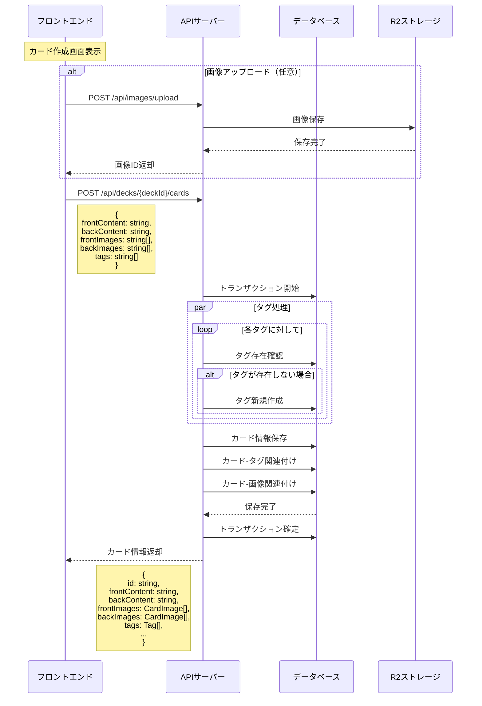

# API設計書

## 1. 基本情報

### 1.1 認証
- Auth0を使用
- JWTトークンをAuthorizationヘッダで送信
- APIリクエストには全てトークンが必要

### 1.2 エンドポイント一覧

#### デッキ関連
- `GET /api/decks` - デッキ一覧の取得
- `POST /api/decks` - 新規デッキの作成
- `GET /api/decks/:id` - デッキ詳細の取得
- `PATCH /api/decks/:id` - デッキ情報の更新
- `DELETE /api/decks/:id` - デッキの削除

#### カード関連
- `GET /api/decks/:deckId/cards` - カード一覧の取得
- `POST /api/decks/:deckId/cards` - 新規カードの作成
- `GET /api/decks/:deckId/cards/:id` - カード詳細の取得
- `PATCH /api/decks/:deckId/cards/:id` - カード情報の更新
- `DELETE /api/decks/:deckId/cards/:id` - カードの削除

#### 画像関連
- `POST /api/images/upload` - 画像のアップロード

#### 学習関連
- `GET /api/study/:deckId/next` - 次の学習カードの取得
- `POST /api/study/:deckId/result` - 学習結果の記録

#### 統計関連
- `GET /api/stats` - 全体の学習統計
- `GET /api/stats/:deckId` - デッキ別の学習統計 

## 2. 主要処理フロー

### 2.1 新規カード作成フロー

#### 処理詳細

1. **画像アップロード（オプショナル）**
   - フロントエンドで画像選択時に即時アップロード
   - アップロード成功後、画像IDを一時保持

2. **カード作成リクエスト**
   - 必須フィールド（frontContent, backContent）の入力確認
   - 事前アップロード済みの画像IDを指定
   - タグ名の配列を送信（既存または新規）

3. **バックエンドでの処理**
   - リクエストバリデーション
   - トランザクション内で以下を実行：
     1. タグ処理（既存タグの利用または新規作成）
     2. カード基本情報の保存
     3. カード-タグの関連付け
     4. カード-画像の関連付け

4. **レスポンス**
   - 作成されたカードの完全な情報を返却
   - フロントエンドでカード一覧に追加

#### エラーハンドリング

1. **画像アップロード時**
   - ファイルサイズ超過: 400 Bad Request
   - 不正なファイル形式: 400 Bad Request
   - ストレージエラー: 500 Internal Server Error

2. **カード作成時**
   - バリデーションエラー: 400 Bad Request
   - 存在しない画像ID: 400 Bad Request
   - デッキ存在確認失敗: 404 Not Found
   - アクセス権限エラー: 403 Forbidden
   - DB保存エラー: 500 Internal Server Error

#### 制約事項

1. **画像関連**
   - サポート形式: PNG, JPEG
   - 最大サイズ: 2MB/枚
   - 最大解像度: 1920x1080px
   - 1面あたりの最大枚数: 10枚

2. **タグ関連**
   - タグ名の最大長: 50文字
   - 1カードあたりの最大タグ数: 20個

3. **コンテンツ関連**
   - テキストコンテンツの最大長: 1000文字 