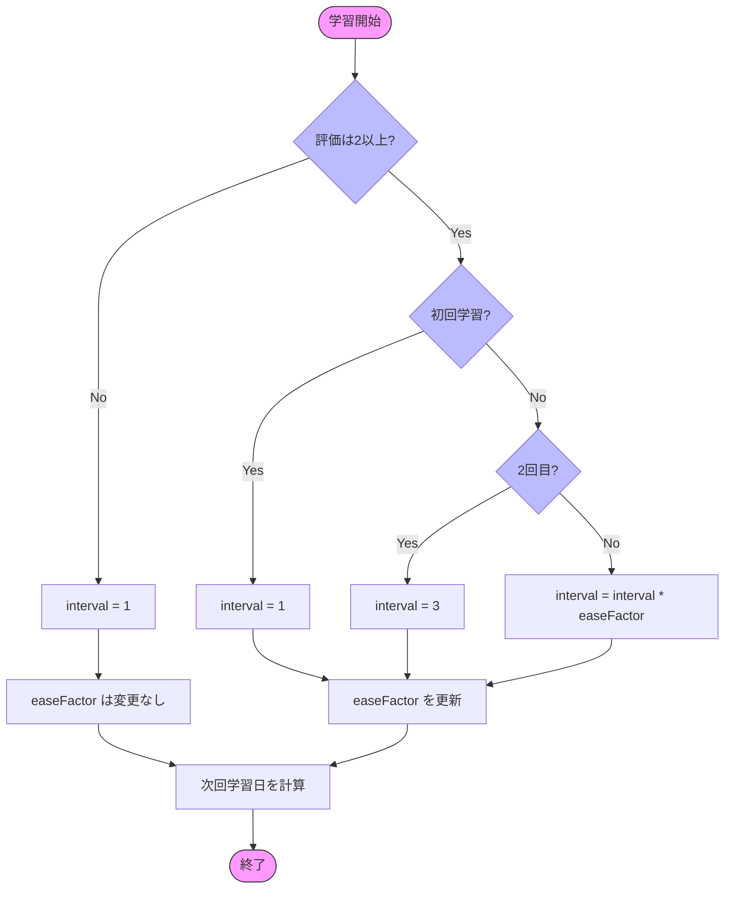

# SM-2アルゴリズム実装ガイド

## 1. 概要

### 1.1 SM-2アルゴリズムとは
SuperMemoで採用されている間隔反復学習アルゴリズムの一つです。
学習者の自己評価（0-3の4段階）に基づいて、次回の学習間隔を決定します。

> 本来のSM-2アルゴリズムでは6段階評価となっている

### 1.2 基本的な考え方
- 正しく覚えているカードは、より長い間隔で復習
- 間違えたカードは、短い間隔で復習
- 学習者の自己評価に基づいて間隔を調整

## 2. パラメータ

### 2.1 学習者の自己評価（grade）
| 評価 | 意味 |
|------|------|
| 0 | 完全に忘れていた |
| 1 | 間違えたが、見たことはあった |
| 2 | 思い出すのに時間がかかった |
| 3 | 完璧に覚えていた |

### 2.2 アルゴリズムのパラメータ
- **interval**: 復習間隔（日数）
- **easeFactor**: 易しさ係数（次回の間隔を決める乗数）
- **nextStudyDate**: 次回学習日

## 3. アルゴリズムの流れ

### 3.1 初期値
```typescript
const INITIAL_EASE_FACTOR = 2.5;
const MINIMUM_EASE_FACTOR = 1.3;
const INITIAL_INTERVAL = 0;
```

### 3.2 基本ロジック
1. 評価が1以下の場合
   - intervalを1日目からやり直し
   - easeFactor変更なし

2. 評価が2以上の場合
   - 初回（interval = 0）: interval = 1
   - 2回目（interval = 1）: interval = 3
   - それ以降: interval = interval * easeFactor
   - easeFactor の更新
   ```typescript
   easeFactor = easeFactor + (0.1 - (3 - grade) * (0.08 + (3 - grade) * 0.08));
   ```

### 3.3 アルゴリズムのフロー図




## 4. 実装上の注意点

### 4.1 日付の扱い
- 日付計算はUTCで統一
- タイムゾーンの違いを考慮

### 4.2 数値の丸め処理
- intervalは整数に丸める
- easeFactor は小数点第2位まで保持

### 4.3 エッジケース
- 評価が3未満の場合でも、easeFactor は維持
- easeFactor が小さくなりすぎないよう下限値を設定
- 間隔が極端に長くなりすぎないよう上限値の設定を検討

## 5. 参考資料
- [SuperMemo 2 Algorithm](https://www.supermemo.com/en/archives1990-2015/english/ol/sm2)
- [Spaced Repetition](https://en.wikipedia.org/wiki/Spaced_repetition) 
